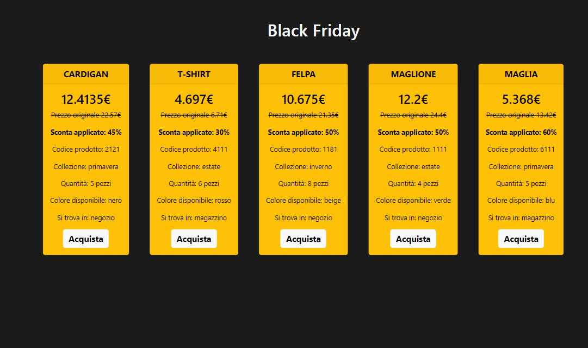

# Counter
Black Friday is a program that displays clothing items with their characteristics using constructors and the Fetch method to retrieve the API in the url provided within the EPICODE project track.

## Table of contents

- [Description](#overview)
  - [Screenshot](#screenshot)
  - [Links](#links)
- [My process](#my-process)
  - [Built with](#built-with)
- [Contacts](#contacts)

## Overview

Black Friday is a program that displays clothing items with their characteristics using constructors and the Fetch method to retrieve the API in the url provided within the EPICODE project track.

### Screenshot

### Links

- Repository URL: [https://github.com/lucavergallo/Black-Friday](https://github.com/lucavergallo/Black-Friday)
- Live Site URL: [https://black-friday-luca-vergallo.netlify.app/](https://black-friday-luca-vergallo.netlify.app/)

## My process

### Built with

- HTML5
- CSS custom properties
- SASS
- JavaScript
- TypeScript
- Bootstrap
- JSON

### Contacts

Luca Vergallo

- LinkedIn: [https://www.linkedin.com/in/luca-vergallo/](https://www.linkedin.com/in/luca-vergallo/)
- Email: l.vergallo@hotmail.it
